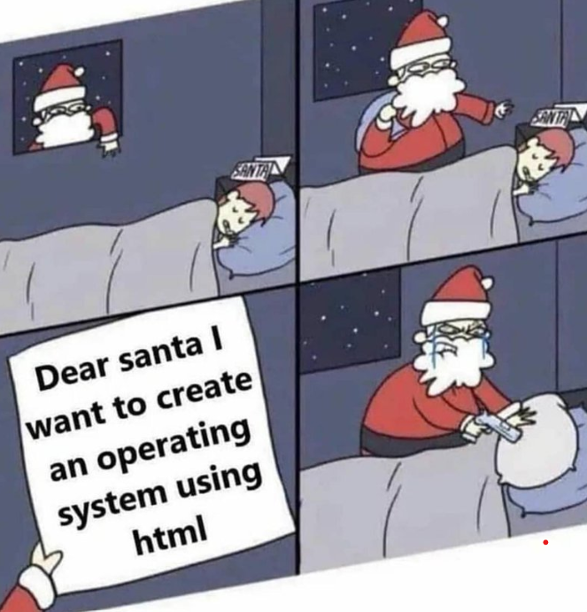
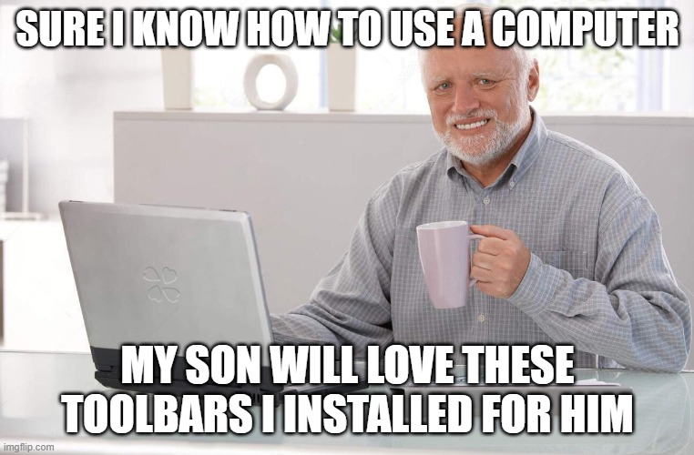
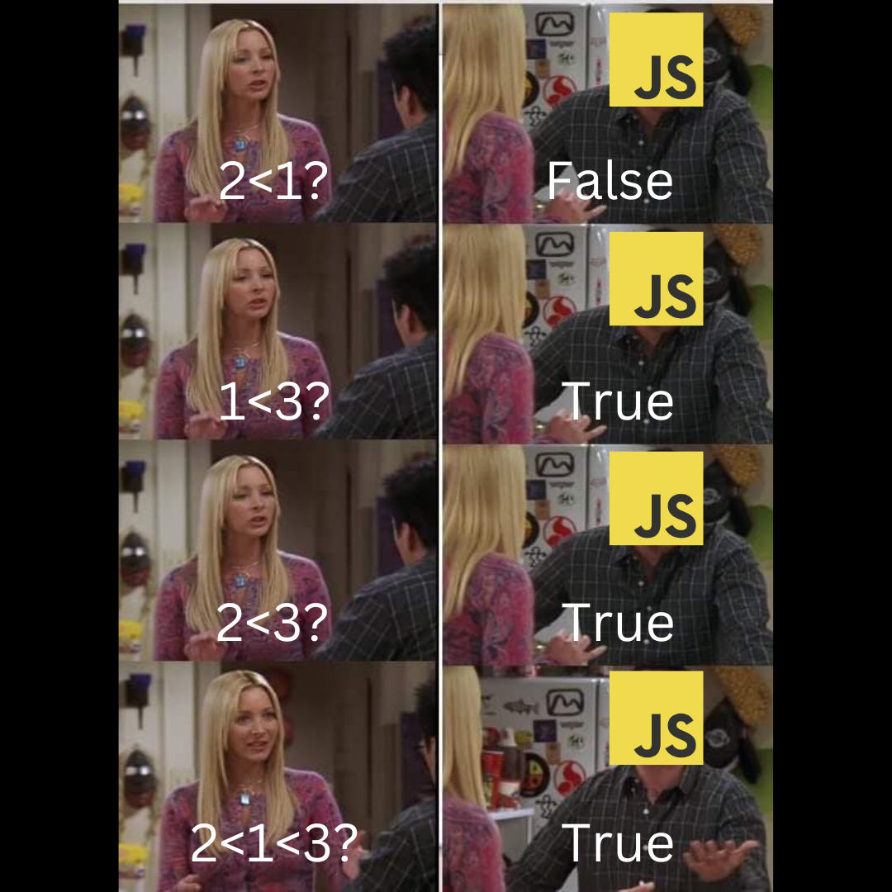

# Welcome to Memetoberfest!


## What is Memetoberfest?

An open source meme contest sponsored by [daily.dev](https://daily.dev)!

👉 Everyone can participate by raising a PR to update the [table at the end of this README](#entries) with the [required details](#How-to-participate).

## Prerequisites

- Knowing what [a meme is](https://en.wikipedia.org/wiki/Internet_meme)
- Having a Twitter profile with open DMs where we can contact you

## Rules

- Please submit only **memes related to software development**
- Do not submit Not Safe For Work (NSFW) memes
- Do not submit offensive memes or memes that target a specific individual (we don't want to offend anyone)
- You can submit more memes but only the first one will be taken in consideration for the prize

## Prizes

The 10 best memes will get daily.dev SWAG!

## How to participate

Make a PR adding a row to the [table below](#entries) with:

- Meme image (or link to it)
- Your Twitter handle
- Notes (optional - explain how we can use this meme)

That's it!

Here is a quick [guide on tables in markdown](https://www.markdownguide.org/extended-syntax/#tables).

## When will be the winners announced?

The winners will be announced on the 7th of November.

Make sure you [follow daily.dev on Twitter](https://twitter.com/intent/follow?screen_name=dailydotdev) to get notified about the contest!

## Entries

| Meme Image or link     | Twitter handle   | Notes                                                              |
| ------------------- | ---------------- | ------- | 
| `<Meme image or link>` | `<Twitter handle>` | `<Notes>` | <!-- Example format. Scroll down to the last row to add your meme. --> |
| | [@frankiefab100](https://twitter.com/frankiefab100) | The moment you are trying to fix a bug while the users think it is working well. |
| | [@instincdev](https://twitter.com/instincdev) | Why we REALLY Join Hacktoberfest  |
|  | [@SudhiKrishnaNA1](https://twitter.com/SudhiKrishnaNA1) | About Googling and Programmers |
|  | [Astrodevil_](https://mobile.twitter.com/astrodevil_) | This meme is best suitable for newbies in tech. |
|  | [tanan__](https://twitter.com/__tanan__) | you can use this to know if developers are actually dead or just pretending |
|  | [Ali Reza](https://twitter.com/Ali_Developer05) | Front-End & Back-End in Real-Life |
|  | [@dejacherese](https://twitter.com/DejaCherese) | For the love of CSS |
|  | [@mezerotm](https://twitter.com/mezerotm) | SpongeBob can't resist new frameworks in his project |
| | [@anthonyjvoss](https://twitter.com/anthonyjvoss) | Normalize using UI tools. Command line isn't always the only option and people should feel ok about that :) |
|  | [@prajwalsuvarna](https://twitter.com/prajwalsuvarnaa) | Concept of oops :stuck_out_tongue_closed_eyes: |
|  | [@brjnrr](https://twitter.com/brjnrr) | Intro to Computing meme **NOR, NAND** |
|  | [@brjnrr](https://twitter.com/brjnrr) | I make a program, however, it depends... |
|  | [@brjnrr](https://twitter.com/brjnrr) | Infinite Cycle |
|  | [@brjnrr](https://twitter.com/brjnrr) | That's programming |
|  | [@lukejanss](https://twitter.com/lukejanss) | classic drake meme |
|  | [@gokulzzzzzzz](https://twitter.com/gokulzzzzzzz) | How C++ reacts to JAVA ! |
|  | [@snehel4510](https://twitter.com/snehel4510) | **What's My address😉** |
|  | [@rupali_codes](https://twitter.com/rupali_codes) | Github Issues |
|  | [@PriteshKiri](https://twitter.com/PriteshKiri) | These is all we listen after years of hard work :) |
|  | [@DevOmar100](https://twitter.com/DevOmar100) | Same Like me 🚀🔥🔥 |
|  | [@omBratteng](https://twitter.com/omBratteng) | This meme feels very meta, and is sure to win |
| |[@intelagense](https://twitter.com/intelagense)|Perfectionists will understand.|
|  | [@merouanezouaid](https://twitter.com/merouanezouaid) | - Do you remember when we were memorizing the periodic table? haha .. me: We still do tho..  What? but you're a computer science major!?? me: ... |
|   |  [@ishan_is_me](https://twitter.com/ishan_is_me)| Meme shows AI taking over world by storm with its image processing ability|
|  | [@codercatdev](https://twitter.com/codercatdev) | Classic JavaScript TypeScript fighting words meme |
| [Link](https://twitter.com/yusmnn/status/1580180830743572480?s=20&t=gGU-t4GbgIOFIREaVcSi9w)|[@yusmnn](https://twitter.com/yusmnn)| Meme shows developers working|
| [Link](https://imgflip.com/i/6tcx2a) | [Twitter](https://twitter.com/pandeysp885) | Vscode Meme |
|  | @RemiRobichet | 'Left Exit 12 Off Ramp' meme |
|  | @idoshamun | There's really nothing better than the feeling of creating a new project |
|  | [@DailyDevTips1](https://twitter.com/DailyDevTips1) | It's what we do |
|  | [@PGautam27](https://twitter.com/PGautam27) | I agree to this😂. Cause I never knew what github pro was during my two years of ug and yet I had it 😂|
|  | @jesulonimii | me when applying for a remote job 😅 |
|  | `DunsinWebDev` | ALT: Clowning when building a new project and trying a new tech stack |
| [Link](https://savvasstephanides.github.io/bucket/memetoberfest/memetoberfest.gif) | @SavvasStephnds | ALT: Animated female character excitedly waving with eyes and mouth wide open |
| | [Amruth Acharya](https://twitter.com/achaamruth) | Pope has praised daily.dev |
|  | [Tc2r1](https://twitter.com/tc2r1) | Constant Pump! |
|  | @SrNascimento40 | An awesome creative meme! Never seen before! Dreamed with it and it's genial!!! |
| | [Pradumna Saraf](https://twitter.com/pradumna_saraf) | No chrome tabs, only daily.dev tabs |
|  | [@heyShubhi](https://twitter.com/heyShubhi) | Nerd-Joke|
|  | [@rishavmitra15](https://twitter.com/rishavmitra15) | |
|  | [@heyShubhi](https://twitter.com/heyShubhi) |  |
|  | [00RohitRoshan](https://twitter.com/00RohitRoshan) | Figuring out which developer you are. when you do many.
| |[@muhib7353](https://twitter.com/muhib7353)| Meme shows Javascript developers are always curious to new frameworks
|  | [@aanxand](https://twitter.com/@aanxand) | A meme that you usually don't see, but can totally relate to as well |
| [Link](https://twitter.com/vivekpal0x/status/1579836408193159169?s=20&t=s_4DvX2hQzi1sBkMvaox1g) | [@vivekpal0x](https://twitter.com/vivekpal0x) | When you run <code> npm i </code>command 😂
| |@MeetwithYash|-|
| |@PallaMohammad| N/A |
|  | @iamsajithk | Emotional |
|  | @boradesanket13 |-|
| [Link](./Image/production-bug-fix-meme.gif) | [@aashishpanthi11](https://twitter.com/aashishpanthi11) | Different level of satisfaction after fixing a bug on production |
|  | [@emSoumik](https://twitter.com/emSoumik) | A typical day of a programmer's life |
| | [goobric Mikal](https://twitter.com/goobric) | Hello World |
|  | @__MoskalykA__ | Small changes in CSS |
|  | @__MoskalykA__ | The reaction to the bugs |
|  | [@ZubeenSyed](https://twitter.com/ZubeenSyed) | You're hired. |
|  | [@ZubeenSyed](https://twitter.com/ZubeenSyed) | DROP TABLE table_name; |
|  | [@ZubeenSyed](https://twitter.com/ZubeenSyed) | That's just the way we roll or rather traverse |
|  | [@ZubeenSyed](https://twitter.com/ZubeenSyed) | Is Python gonna replace Internet Explorer now :D |
|  | [@ZubeenSyed](https://twitter.com/ZubeenSyed) | Just missed out by an = |
|  | [Tc2r1](https://twitter.com/tc2r1) | Programming Wizard! |
|  | [@piece_of_irony](https://twitter.com/piece_of_irony) | 
|  | @ShrutiGajbhiye9 | create an operating system using HTML |
|  | [GokulZuzumaki](https://twitter.com/GokulZuzumaki) | CI runs are the primary reason for my softcore trauma |
|  | @shoraysinghal | Emotional |
|  | @Abubakrce19 | We are not same bro. |
|  | @Feranmiayomikun | You can use it to advise devs to be 100% sure of what they develop before delivering it out. You're free to ask for the original copy (without my signature/handle on it) |
|  | '@seunakinzz' | 'Learning html for the first time' |
| [Link](https://twitter.com/leopaul29/status/1583482227710914561) | [@leopaul29](https://twitter.com/leopaul29) | |
| [Link](https://photos.app.goo.gl/DRMpqwHDeSNiNVzw7) | [ShorunTech](https://twitter.com/shoruntech) | Me Trying to continue my #100DaysOfReadingAnArticles|
|  | [@\_slowflash\_](https://twitter.com/_slowflash_) | HacktoberFest vibes🥹 |
| [Link](https://drive.google.com/file/d/1_GxWIkGWSxWb2tS-rbWBxZf4SBFDyx4C/view?usp=sharing) | @dev_aslam | Aslam Hossain |
|  | @TomaszHamerla | Mission of this meme: to convince devs to stop neglecting the docs |
|  | @tradeguru007 | Funny |
|  | @RohitCode25 | If someone tell you can't google your every problem 😁 |
|  | @Divvstwt
|  | @techspiritss | Going to fix that leak taking 2GB RAM memory
|  width="500"> | [@bxtgeek](https://twitter.com/@bxtgeek) | `Supremacy of memetoberfest` |
|  | [@bxtgeek](https://twitter.com/@bxtgeek) | `HarlodOps` |
|  | [@bxtgeek](https://twitter.com/@bxtgeek) | `chaotic intern` |
|  | [@bxtgeek](https://twitter.com/@bxtgeek) | `Grandma IT Guy` |
|  | [@bxtgeek](https://twitter.com/@bxtgeek) | `developer Calendar` |
| [Link](https://pin.it/2AubzJI) |@Moyin2_| |Fixing bug issues|
| [Link](https://pin.it/5tulnnj) |@Moyin2_| |bugs issues ahahaha|
|  | [@amakarivas](https://twitter.com/amakarivas) | Stack Overflow to the rescue |
|  | @jhayjahswill | When you have set the z-index propert to 10000 and the div still isn't showing 😂 |
| [Link](https://twitter.com/PR0GRAMMERHUM0R/status/1582235055845675009)  | [Pradeep Rao K](https://twitter.com/PradeepRaoK1) | Meme about github contributors |
|  | [@var_rishabh](https://twitter.com/var_rishabh)| Software those days were easy to repair. |
|  | [@captainWaheed43](https://twitter.com/captainWaheed43) | Everytime |
|  | [@alexandrescca](https://twitter.com/alexandrescca) | |
|  | [@turaakk](https://twitter.com/turaakk) | vscode was not happy |
|  | [@ManJo78343025](https://twitter.com/ManJo78343025) | Daily.dev is for developers what peanut is for butter  |
|  | @BeeC0des | Error Overthinking Meme, You can not try to solve a bug the next day with a fresh perspective, why because you can never stop thinking about it, Rather (REST Your MIND DEV!)|
|  | [@LeviArista](https://twitter.com/LeviArista) | |
|  | [@LeviArista](https://twitter.com/LeviArista) | |
| [Link](image/memeArsalan.jpg) | [@Arsalan_0101](https://twitter.com/Arsalan_0101) | `A normal day in the life of programmers` |
|  | @KiranRai425 | hacking scene in movie |
|  | [@shivanshx365](https://twitter.com/shivanshx365) | This is how debugging works in real life |
|  |[Aarya Chopkar](https://twitter.com/ChopkarAarya) | ```Programmers VS Mathematicians``` |
|  | [Tania Banerjee](https://twitter.com/taniaban2712) | `When the code works fine but you don't understand why` |
|  | @PrabhatSar10 | Life of a developer, full of misery! |
| [Link](https://shorturl.at/adEMS) | [@rajeshkhadka200](https://twitter.com/rajeshkhadka200) | Ley : developer don't know about docker 😂 |
|  | [@00BISWAJIT](https://twitter.com/00BISWAJIT) | 
|  | [@utsavbhatrai007](https://twitter.com/utsavbhatrai007) | Programmer pain |
|  | [@utsavbhatrai007](https://twitter.com/utsavbhatrai007) | Programmer can fix a printer but not being a programmer😂 |
|  | [@arnavkr_](https://twitter.com/arnavkr_) | When apple launches a cutting Edge Mac 😉 |
| [Link](https://twitter.com/ankiitamalik/status/1580387982217211905?s=20&t=8L8RtATQcNXcei2l2zB6UQ) | [ankiitamalik](https://twitter.com/ankiitamalik) | College Assignments 😂 |
|  | [@tobi_ui](https://twitter.com/tobi_ui) | When you only test on local | 
|  | @debanjanaly | Who is the strongest on this planet ? |
|  | @devMukhtar | the moment your uncle ask you to fix his printer because you told him you are a developer | 
|  | [@kundan_k_](https://twitter.com/kundan_k_) | - oh that's why |
|  | [@Divvstwt](https://twitter.com/Divvstwt) | 
|  | [@0ayaanqadri](https://twitter.com/0ayaanqadri) | `Beginners reality` |
|  | [0xRinshin](https://twitter.com/0xRinshin) | My code and code in the tutorial!
|  | [@terieyenike](https://twitter.com/terieyenike) | Job meme |
|  | [@terieyenike](https://twitter.com/terieyenike) | It works on my system |
|  | [Harshit Gupta](https://twitter.com/Harshit60886919) | `A meme that you can totally relate to` |
|  | [@20jasper](https://twitter.com/20jasper) |  |
|  | [Ruchita](https://twitter.com/_ruchita1010) | When stackoverflow doesn't help, F12 or Ctrl+Shift+I does 😂 |
|  | [@whistle_xd](https://twitter.com/whistle_xd) | SAD |
| [Link](https://imgflip.com/i/6wrof7) | [@its_SusmitaDey](https://twitter.com/its_SusmitaDey) | Ft. Daily.dev careers |
| | @khair_alanam | A meme on JS :) |
|  | [@covertgravy](https://twitter.com/covertgravy) | TDD |
|  | @axolodev | Nothing | 
|  | `ashishk1331` | `Dwag uses semi-colon in python` |
| [Link](https://twitter.com/Fais18130049/status/1581600359109529607/photo/1) | @Fais18130049 | Based on the most famous dailogue in an indian movie. |

<!-- Add your meme directly above this comment. -->


## Credits

[Hacktoberfest](https://hacktoberfest.com/?ref=dailydev) is a registered trademark of [DigitalOcean](https://www.digitalocean.com/?ref=dailydev). We would like to give them a huge shout out and credit for supporting the global open source community through the Hacktoberfest initiative!
If you haven’t signed up yet, we highly recommend every developer to [check it out](https://hacktoberfest.com/participation/?ref=dailydev) :raised_hands:
